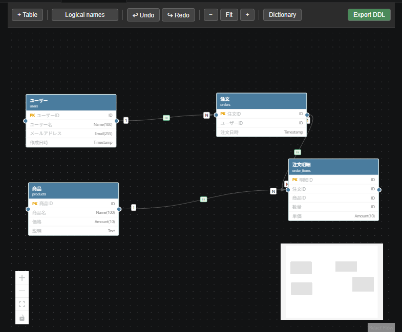

# markdown-er

**VSCode extension — Interactive ER diagram editor backed by plain Markdown files.**



---

## Overview

`markdown-er` lets you design and maintain ER diagrams entirely inside VSCode.  
The diagram is stored in a standard `.md` file (with `er-diagram: true` in the front matter), so it is **human-readable, diffable, and version-control friendly** — no proprietary binary format, no separate toolchain.

---

## Features

| Feature | Details |
|---|---|
| **Interactive canvas** | Drag tables to reposition, resize with handles, pan & zoom |
| **Column-type dictionary** | Define reusable DB types (e.g. `UserID → INT`, `Name → VARCHAR(100)`) and apply them to columns |
| **Logical / Physical names** | Every table and column carries both a logical name (e.g. `ユーザー`) and a physical name (e.g. `users`). Toggle the view with one click. |
| **Relations** | Drag from one table to another to create a relation. Click the relation to set cardinality (1:1 / 1:N / N:N) and optionally add a FK constraint. |
| **Undo / Redo** | Full history via `Ctrl+Z` / `Ctrl+Y` |
| **Persistent layout** | Positions and viewport are saved back to the `.md` file automatically |
| **DDL export** | Export full `CREATE TABLE` DDL, or diff-only `ALTER TABLE` statements against a git baseline |
| **Auto Layout** | Arrange all tables automatically — Vertical, Horizontal, or Auto. The result is undo-able with `Ctrl+Z` |
| **Plain Markdown storage** | The diagram lives in your repo alongside your code — review it in PRs like any other file |

---

## Getting started

### Prerequisites

- VSCode 1.85+
- Node.js 20+

### Install from source

```bash
git clone https://github.com/Nobuyuki-Inaba/markdown-er.git
cd markdown-er

# Install dependencies
npm install
cd webview && npm install && cd ..

# Build
npm run build          # builds WebView (→ media/) and extension host (→ out/)
```

Press **F5** in VSCode to launch the Extension Development Host.

### Open a diagram

1. Create a `.md` file with the following front matter (or open `examples/sample.md`):

```markdown
---
er-diagram: true
version: 1
---

# My ER Diagram
```

2. Click the **⊹** icon in the editor title bar, or right-click the file in the Explorer → **Open as ER Diagram**.

---

## Usage

### Add a table

Click **+ Table** in the toolbar. A new table appears at the center of the viewport.  
Double-click the table to open the edit panel.

### Edit a table

Double-click any table to open the **Table Edit Panel** on the right.

- Set the logical name (display) and physical name (database)
- Add columns with the **+ Add Column** button
- For each column: choose a dictionary type, toggle PK, set nullable

### Define column types (Dictionary)

Click **Dictionary** in the toolbar.  
Add reusable types like `UserID → INT`, `Name → VARCHAR(100)`, `Timestamp → DATETIME`.  
Columns pick a dictionary entry instead of specifying type and length directly.

### Create a relation

Drag from the **◉ handle** on one table to another table.  
Click the relation line to set:
- **Cardinality**: 1:1 / 1:N / N:N
- **From / To columns**
- **Foreign key** constraint (optional)

### Delete

Click a table or relation to select it, then press **Delete**.

### Toggle names

Click **Logical names** / **Physical names** in the toolbar to switch all labels between logical and physical names.

### Zoom & fit

| Button | Action |
|---|---|
| `−` | Zoom out |
| `Fit` | Fit all tables in view |
| `+` | Zoom in |

The bottom-left **Controls** widget also provides zoom and fit buttons.

### Export DDL

Click **Export DDL** in the toolbar (or run `ER Diagram: Export DDL (Full)` from the Command Palette).  
For diff-only output run `ER Diagram: Export DDL (Diff)` and enter a git ref (e.g. `HEAD~1`).

---

## File format

The diagram is stored in a `.md` file using YAML front matter and `ermd-*` fenced blocks:

```markdown
---
er-diagram: true
version: 1
---

# EC Site

## Dictionary
```ermd-dictionary
- id: dict_id
  name: ID
  dbType: INT
  length: null
  notNull: true
  comment: ""
```

## Tables
```ermd-table
id: tbl_user
logicalName: ユーザー
physicalName: users
comment: ""
columns:
  - id: col_u1
    logicalName: ユーザーID
    physicalName: user_id
    dictionaryId: dict_id
    isPrimaryKey: true
    isNullable: false
    defaultValue: null
    comment: ""
```

## Relations
```ermd-relations
- id: rel_1
  fromTableId: tbl_user
  fromColumnId: col_u1
  toTableId: tbl_order
  toColumnId: col_o2
  cardinality: ONE_TO_MANY
  hasForeignKey: true
  constraintName: fk_orders_user_id
  comment: ""
```

## Layout
```ermd-layout
nameMode: logical
tables:
  - tableId: tbl_user
    x: 60
    y: 60
    width: 260
viewport:
  x: 0
  y: 0
  zoom: 1
```
```

---

## Keyboard shortcuts

| Key | Action |
|---|---|
| `Ctrl+Z` | Undo |
| `Ctrl+Y` / `Ctrl+Shift+Z` | Redo |
| `Delete` | Delete selected table or relation |
| Double-click | Open table edit panel |

---

## Tech stack

| Layer | Technology |
|---|---|
| Extension host | TypeScript, VSCode Extension API, js-yaml |
| WebView UI | React 18, @xyflow/react v12, Zustand + zundo |
| Build | Vite (WebView), tsc (extension host) |

---

## License

MIT — see [LICENSE](LICENSE)
